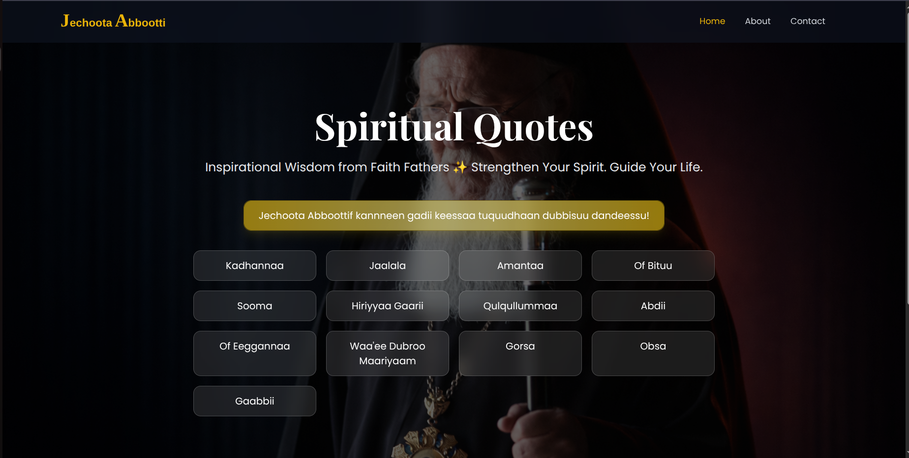
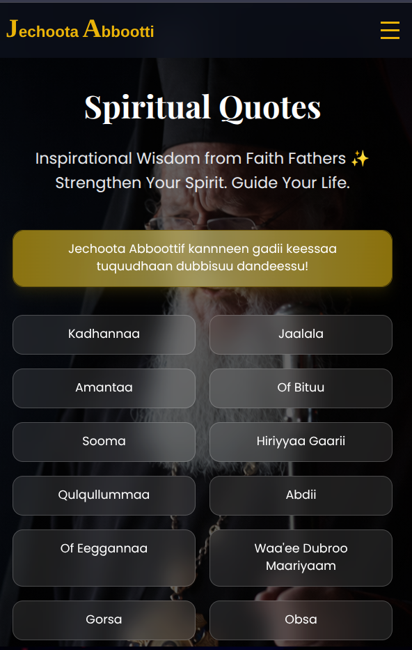

#  Jechoota Abbootti

> ✨ Spiritual Quotes in Afan Oromo  
> Modern • Inspirational • Faith-Centered • Fully Responsive  

🔗 **Live Demo:** https://jechoota-abbootti.vercel.app/

---

## 📖 About The Project

**Jechoota Abbootti** is a beautifully designed spiritual quotes platform built with **Nuxt 3** and **Tailwind CSS**.  
It presents wisdom from faith fathers in Afan Oromo through a modern, clean, and inspiring interface.

This project was created to:

-  Strengthen spiritual life  
-  Encourage moral and personal discipline  
-  Preserve spiritual teachings in Afan Oromo and more soon 
-  Combine faith with modern UI/UX design  

---
## 🖥 Desktop & 📱 Mobile Preview

<p align="center">
  
  
</p>

---


## ✨ Features

- Categorized spiritual quotes
- Independent route for each category
- Reusable Apple-style `QuoteCard` component
- Glassmorphism UI design
- Fully responsive layout
- Smooth animations & transitions
- Tailwind CSS custom styling

---

## 📂 Project Structure

```
.
├── app.vue
├── assets
│   └── css
│       └── main.css
├── components
│   ├── Abdii
│   │   └── abdiiQuotes.js
│   ├── Amantaa
│   │   └── amantaaQuotes.js
│   ├── common
│   │   ├── Footer.vue
│   │   └── NavBar.vue
│   ├── Gaabbii
│   │   └── gaabbiiQuotes.js
│   ├── Gargarsaa
│   │   └── gargarsaaWaaqayyooQuotes.js
│   ├── Gorsa
│   │   └── gorsaQuotes.js
│   ├── HiriyyaaGaarii
│   │   └── hiriyyaaGaariiQuotes.js
│   ├── Jaalala
│   │   └── jaalalaQuotes.js
│   ├── Kadhannaa
│   │   └── kadhannaaQuotes.js
│   ├── Maariyaam
│   │   └── waaeeDubrooMaariyaam.js
│   ├── Obsa
│   │   └── obsaQuotes.js
│   ├── OfBituu
│   │   └── ofBituuQuotes.js
│   ├── OfEeggannaa
│   │   └── ofEeggannaaQuotes.js
│   ├── Qulqullummaa
│   │   └── qulqullummaaQuotes.js
│   ├── QuoteCard.vue
│   └── Sooma
│       └── soomaQuotes.js
├── composables
│   └── useQuotes.js
├── layouts
│   └── default.vue
└── pages
    ├── abdii.vue
    ├── about.vue
    ├── amantaa.vue
    ├── contact.vue
    ├── gaabbii.vue
    ├── gorsa.vue
    ├── hiriyyaa-gaarii.vue
    ├── index.vue
    ├── jaalala.vue
    ├── kadhannaa.vue
    ├── obsa.vue
    ├── of-bituu.vue
    ├── of-eeggannaa.vue
    ├── qulqullummaa.vue
    ├── sooma.vue
    └── waaee-dubroo-maariyaam.vue
```

---

## 🛠 Tech Stack

- **Nuxt 3**
- **Vue 3 (Composition API)**
- **Tailwind CSS**
- **Vercel (Deployment)**

---

## 🚀 Getting Started

### Clone the repository

```bash
git clone https://github.com/your-username/jechoota-abbootti.git
```

### Navigate into project

```bash
cd jechoota-abbootti
```

### Install dependencies

```bash
npm install
```

### Run development server

```bash
npm run dev
```

Open:

```
http://localhost:3000
```

---

##  Deployment

This project is deployed using **Vercel**.

Deployment Steps:

1. Push your code to GitHub  
2. Connect the repository to Vercel  
3. Deploy automatically  

---

## Future Improvements

- 🔍 Search functionality  
- ❤️ Favorite quotes feature  
- 📤 Share quote option  
- 🌐 Multi-language support  
- 🎧 Audio quote reading  
---

## 👨‍💻 Developer

**Moges Sisay**  
Software Engineering Student  
MERN Stack Developer  

📧 mogesse741@gmail.com  

---

## 🤝 Quotes Contributor

**Ayantu**  
Biomedical Engineering Student  
Spiritual Content Contributor  

---

⭐ If you like this project, consider giving it a star on GitHub.
